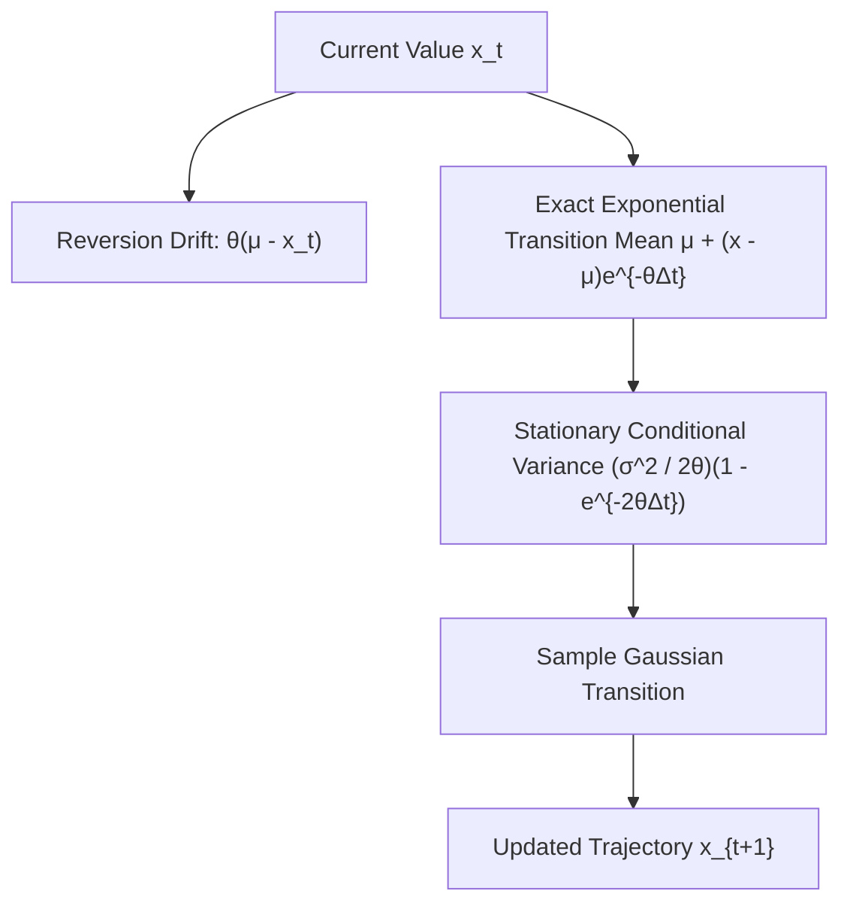

# Ornstein-Uhlenbeck Mean-Reverting Process Skill

Exact discrete transition simulation for stationary Gaussian mean-reverting stochastic processes.

## Features
- **100% Python Standard Library**: Exact conditional distribution evaluation.
- **Zero Discretization Bias**: Avoids naive Euler approximations.
- **Physical & Financial Applications**: Models friction, velocity relaxation, and interest rates.
